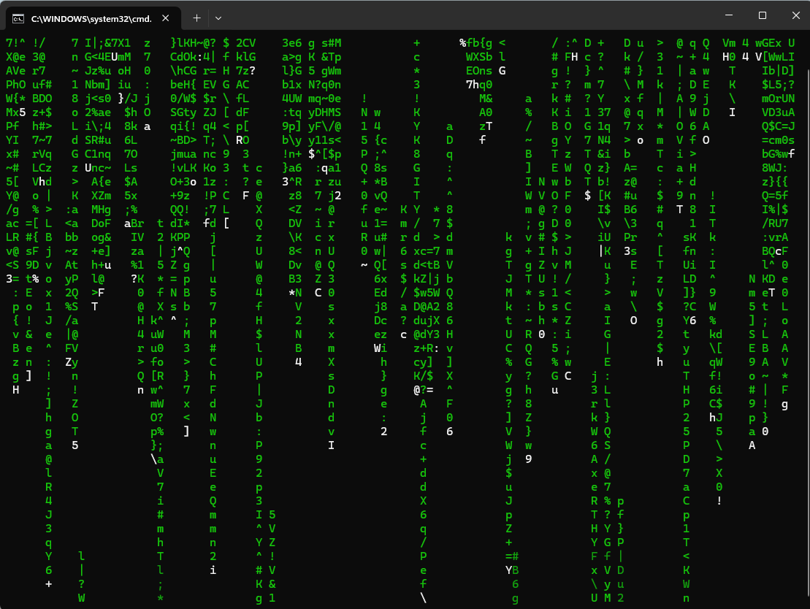

# cmatrix-win

Matrix digital rain effect for the Windows terminal, written in C.

Inspired by the original Linux [cmatrix](https://github.com/abishekvashok/cmatrix) by Abishek Vashok.



## Requirements

- Windows 10 or later (needs ANSI/VT support)
- A terminal with a monospace font — [Windows Terminal](https://aka.ms/terminal) recommended
- For `-c` (katakana): a font that includes half-width katakana, e.g. MS Gothic or Cascadia Code

## Usage

```
cmatrix [-b] [-B] [-c] [-r] [-s speed]
```

| Option | Description |
|--------|-------------|
| `-b` | Bold characters on |
| `-B` | All bold (overrides `-b`) |
| `-c` | Use katakana characters |
| `-r` | Rainbow colors |
| `-s 1-9` | Speed: 1 = slow, 9 = fast (default 5) |

Press any key to exit.

## Building

Requires MinGW (gcc) or MSVC. With MinGW:

```bat
build.bat
```

Or manually:

```
gcc -O2 -o cmatrix.exe cmatrix.c
```

> **Note:** Make sure `C:\MinGW\bin` is in your PATH before running gcc.
